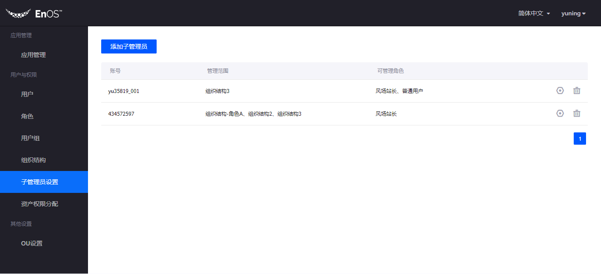

# APP Portal产品用户手册

# 1. 功能概述

App Portal 是通用灵活的权限管理和统一登录门户，它提供给应用开发者一套基于RBAC的统一权限体系和登录门户，同时保证终端用户可以在同一套系统，同一套用户和权限，统一的用户体验下，流畅的访问和使用应用，提高安全控制，降低研发成本。主要包括以下功能：

1.	基于RBAC的权限管理，包括角色，权限，用户组，组织结构等通用能力
2.	通过资产管理层级，自动授权客户资产
3.	通过子管理员配置，分层分级授权管理
4.	开放应用菜单配置，实现用户跨应用访问
5.	统一门户和个性化配置，实现多OU切换
6.	提供实名认证、多因子认证，和安全等级防护（规划中）

- 以上App Portal功能的实现基于下图所示的完整环节和流程

  

- App Portal按照功能划分可分为应用Portal和管理后台两大模块，下面将分别介绍这两个模块的功能和使用方法。

# 2. 管理后台介绍

- 总体介绍：管理后台是帮助企业/组织的管理员实现基于用户、角色、组织结构、应用等多方面权限的集中管理和分级管理

- 功能范围：
1. 企业/组织的管理员：用户、角色、用户组、组织结构、子管理员设置、资产权限分配、应用管理、OU设置

2. 企业/组织的子管理员：用户、资产权限分配

- 操作路径：
1. 企业/组织的管理员或子管理员进行登录
  
2. 登录成功后，如果管理员或子管理员有应用的访问权限，则会进入Portal首页，点击【进入管理后台】即可进入

3. 登录成功后，如果管理员或子管理员还没有任何应用或菜单权限，则会直接进入管理后台
  

## 1. 用户与权限—用户

1 . 功能说明

- 添加／移除用户
 - 添加用户：i）将已在系统中创建账号的用户添加到当前企业/组织 ii）给还未创建账号的用户新建账号并将其添加进企业/组织
 - 移除用户：将用户移出企业/组织

- 管理用户
 - 给用户添加／移除角色
 - 给用户添加／移除组织结构
 - 给用户添加／移除用户组

2 . 名词解释

- 角色：角色是一组功能权限的集合，包括菜单访问权限和权限点，给用户分配角色后，用户即获得相应菜单的访问权限和权限点
- 组织结构：组织结构是一种以节点为管理单元的资产管理层级关系（如以地理位置设置为层级），将人员分配到组织结构后，可实现组织结构内用户自动获得下级节点访问权限
- 用户组：同一个用户组内的用户拥有相同的资产访问权限

3 . 操作步骤

- 进入：点击左侧菜单栏二级菜单【用户】即可进入用户模块， 在用户模块首页上可进入添加用户、移除用户、 管理用户功能模块
  
- 添加用户：点击【添加用户】按钮，通过输入邮箱搜索用户
  
 - 若系统中该邮箱已存在账号，则可直接选择该用户，将期添加进企业/组织
 - 若用户账号还不存在，则可点击【新建用户】创建账号，账号名默认为邮箱前缀，可编辑，提交后账号将不再支持修改，创建完成后，用户将收到通知邮件，且邮件里有设置密码的链接。
  
  
- 移除用户：点击用户列表最右边的【移除】图标

 - 点击移除后，系统会进行二次确认
 - 确认移除后，该用户将不属于本企业/组织
  
- 管理用户：点击用户列表上【管理】图标，进入到用户管理页面
  
 - 编辑用户信息：点击【编辑】按钮，可编辑用户姓名和手机号
  
 - 重置用户密码：点击【重置密码】按钮，进行二次确认，确认重置后，用户会收到带有重置密码链接的邮箱，用户点击邮箱中的链接即可进行重新设置密码的操作
  
 - 分配角色：点击【分配角色】按钮，即可选择要给用户分配的角色，可多选，用户被赋予角色后，将被授予该角色拥有的权限

 - 移除角色：点击【移除】图标，移除后，用户将不再获得该角色相关权限，但可以移除后再给该用户重新分配该角色
  
  
 - 分配组织结构：点击【分配组织结构】即可选择要给用户分配的组织结构，可多选，用户加入组织结构后，将同时被赋予组织结构相应的资产查看权限
 - 规则：选择了父节点，下级节点不能被勾选，但默认具有下级节点的权限
 - 移除组织结构：点击【移除】图标，移除后，用户将不再获得该组织结构相关权限，但可以移除后再给该用户重新分配该组织结构
  
 - 分配用户组：点击【分配用户组】即可选择要给用户分配的用户组，可多选，用户加入用户组后，将同时被赋予用户组相应的资产查看权限
 - 移除用户组：点击【移除】图标，移除后，用户将不再获得用户组相关权限，但可以移除后再给该用户组重新分配该组织结构

##2. 用户与权限—角色

1 . 功能说明：

- 新增／删除／查看角色
- 管理角色
 - 给角色分配菜单组
 - 给角色分配权限点

2 . 名词解释

- 权限点：权限点是应用内命名的，有特定操作的权限名称，将权限点分配给角色后，该角色的用户具备相应的权限点操作能力
- 菜单组：菜单组是应用内菜单的集合，可以组合菜单形成菜单组，将菜单组分配给角色，角色即拥有了菜单组内菜单的访问权限。

3 . 操作步骤

- 进入：通过左侧菜单栏可进入到【角色】模块， 在角色模块首页上可进入新建删除角色、管理角色功能模块

  

- 新建角色：点击【新建角色】按钮，通过给角色命名和添加描述来新建一个角色

  

- 给角色分配菜单组

 - 第一步：先选择一个该角色所在的应用
 - 第二步：给已选择的应用中的该角色分配菜单组

  

  
 
- 给角色分配权限点

 - 第一步：先选择一个该角色所在的应用

 - 第二步：给已选择的应用中的该角色分配权限点

  
 
  
 

 

##3. 用户与权限-用户组

1 . 功能说明
新建／删除／查看／编辑用户组

2 . 名词解释
用户组：同一个用户组内的用户拥有相同的资产访问权限

3 . 操作步骤

- 进入：通过左侧菜单栏可进入到【用户组】模块， 在用户组模块首页上可进入新建/删除/编辑用户组功能模块
  

- 新建用户组：点击【新建用户组】按钮，通过给角色命名和添加描述来新建一个用户组
  

- 编辑用户组：点击【编辑】图标
  

- 删除用户组：点击【删除】图标，删除用户组后，相关权限也将被解除
  

 

##4. 用户与权限-组织结构

1 . 功能说明

- 新建／删除 组织结构
- 开启/关闭组织结构自动分配，开启自动分配后，组织结构内的用户将自动获得下级节点的访问权限
- 同步资产，将将本组织已接入并打标签的资产，从开发者平台同步到应用门户，同步完成后，才可为用户分配资产权限
- 管理资产

 - 给节点添加下级节点
 - 查看节点下的用户信息
 - 管理叶子节点下的资产
 - 删除/重命名节点

2 . 名词解释
- 组织结构：组织结构是一种以节点为管理单元的资产管理层级关系（如以地理位置设置为层级），将人员分配到组织结构后，可实现组织结构内用户自动获得下级节点访问权限。

3 . 操作步骤

- 通过左侧菜单栏进入【组织结构】模块， 在组织结构模块首页上可进行新建/删除组织结构、管理角色、同步资产、关闭/开启自动分配操作

  

- 同步资产：点击【同步资产】按钮，需要管理的资产数据就会同步到系统上

- 开启/关闭自动分配

 - 开启自动分配后，组织结构内的用户将自动获得下级节点的访问权限
 - 关闭自动分配后，系统将不再根据用户所在节点自动分配资产访问权限

- 新建组织结构：点击【新建组织结构】按钮
 
  

- 管理组织结构：点击【管理】图标，进入组织结构管理模块，可进行添加下级节点、管理资产、管理用户、重名命、删除操作

  

 - 添加下级节点：点击【添加下级节点】，输入节点名称，即可添加

  

 - 查看用户：点击【查看用户】，即展示属于该节点的用户列表

  

 - 管理资产：点击【管理资产】，即可把未分配的资产分配给组织节点，也可将已分配的资产退回为未分配状态
 - 规则：只有叶子节点（底层节点）可以被分配和管理资产

  

- 删除组织结构：点击【删除】图标

 - 删除成功：删除操作不可撤回
 - 删除失败：若组织结构已分配用户或资产，则无法删除

  

  

- 重命名：点击【重命名】，可为组织节点重新命名

  

 
##5. 用户与权限—子管理员设置

1 . 功能说明

- 添加/移除子管理员 
- 管理子管理员权限范围

2 . 名词解释
- 子管理员：子管理员可以在特定组织结构范围内，管理相应的人员权限，比如分配角色和分配资产访问权限。

3 . 操作步骤

- 通过左侧菜单栏进入【子管理员设置】模块， 在子管理员设置模块首页上可进行添加/移除子管理员、管理子管理员操作

  

- 添加子管理员：点击【添加子管理员】按钮

  

 - 选择用户：输入用户的邮箱进行查找
 - 设置管理范围：为子管理员配置可以管理的组织结构节点范围，设置后，子管理员只可以给管理范围内的人员分配角色和资产访问权限
 - 选择可管理角色：选择子管理员可以分配给用户的角色范围

- 管理子管理员：更改子管理员的管理范围和可管理角色

 

##6. 资产管理-资产同步&资产权限分配

1 . 功能说明
- 资产同步：将资产数据同步更新到系统上
- 给用户／用户组，手工分配资产访问权限

2 . 名词解释
- 资产权限：用户可通过应用看到相关资产数据

3 . 操作步骤
- 资产同步：通过左侧菜单栏可进入到【资产同步】模块，点击【同步资产】按钮，即可将更新的资产数据同步到系统

  

- 资产权限分配

 - 通过左侧菜单栏可进入到【资产权限分配】模块， 在资产权限模块首页上可对用户/用户组进行资产管理操作

 - 移除资产：点击【移除】图标，可将该用户已有的资产移除

  

 3) 管理资产

- 选中某个用户/用户组，点击【管理资产】按钮，可将资产批量分配给用户/用户组

  

 

##7.  应用管理

1 . 功能说明：

- 开启／关闭OU已购买的应用，关闭将对OU的全体成员不可见
- 给应用分配展示的组织结构
- 设置应用的菜单组

2 . 名词解释

- 组织结构：组织结构是一种以节点为管理单元的资产管理层级关系（如以地理位置设置为层级），将人员分配到组织结构后，可实现组织结构内用户自动获得下级节点访问权限

- 菜单组：菜单组是应用内菜单的集合，可以组合菜单形成菜单组，将菜单组分配给角色，角色即拥有了菜单组内菜单的访问权限

3 . 操作步骤

- 进入：通过左侧菜单栏可进入到【应用管理】模块， 在应用管理首页上可进行启用/关闭应用、给应用分配组织结构、管理应用菜单组三项操作

- 启用/禁用应用

 - 启用：启用后，全部人员可见该应用
 - 禁用：禁用后，全部人员将不可见该应用

  

- 分配组织结构：点击【分配组织结构】图标，将应用分配给已经创建好的组织结构

  

- 管理菜单组：

 - 重命名/删除菜单组：点击【重命名/删除】，对应用内已有的菜单组重命名或删除

  

 - 配置菜单：点击【配置菜单】按钮，给应用内的菜单组配置菜单，可多选

 - 规则：勾选了上级菜单，所属下级菜单默认被勾选

  

 - 新建菜单组：点击【新建菜单组】

  

 

##8.  其他设置—OU设置

1 . 功能说明

- 查看OU基本信息
- 更换LOGO 
- 更换管理员
- 操作步骤
 - 进入：通过左侧菜单栏可进入到【OU设置】模块， 可进行更换管理员、更换Logo操作

  

 - 更换Logo：点击【重新上传】按钮

 - 更换管理员：点击【更换管理员】按钮

 - 当前管理员可将管理员身份转移给企业/组织内已存在的用户，提交后当前管理员不再是管理员

  

#3. Portal介绍
- 总体介绍：给用户提供多领域多领域的应用统一门户，可帮助用户便捷的实现跨企业/组织、跨应用的访问
- 功能范围：切换应用、切换语言、用户信息、进入管理后台、修改密码、切换OU、帮助中心（规划中）、消息中心（规划中）
- 操作路径：
1 . 用户登录：输入账号密码进行登录，如果忘记密码， 可点击【忘记密码】进行密码重置，登录之后选择进入的企业/组织，如果只有一个企业/组织，系统自动进入

  

2 . 进入Portal：登录成功后，会默认进入应用列表中的第一个应用的首页，如果还没有应该权限，页面会报错，可以联系管理员进行应用权限开通

  

3 . 切换应用：点击左上角的【展开】标志，即展示出有所有已开启并由权限的应用列表，点击想访问的应用，即可实现应用的切换

- 规则：如果访问的应用还没有 权限，或应用中还无任何菜单的权限，页面会报错，可联系管理员开通应用或应用中菜单的权限

  

4 . 切换语言：点击右上角的【语言】可进行语言的切换

  

5 . 修改密码：点击右上角的【修改密码】，则可重新设置密码

  

  

6 . 切换企业/组织：点击右上角的切换企业/组织可进行切换

  

7 . 帮助/文档中心：点击右上角“问号”图标可进入帮助中心

8 . 消息中心：点击右上角的“铃铛”图标可进入消息中心

9 . 进入管理后台：企业/组织的管理员或子管理员可以看到【进入管理后台】按钮，点击即可进入管理后台，点击左上角企业的Logo则可返回Portal首页